# TPT Restaurant & Cafe
## http://tpt.000.pe Deployed Link
A full-stack website developed using PHP, designed for TPT Restaurant & Cafe to go online. The site features a cool and responsive UI/UX, including online table booking, menu display/view, testimonials, location/contact information, services, and an admin panel.

## Table of Contents
- [Features](#features)
- [Tech Stack](#tech-stack)
- [Installation](#installation)


## Features

### Responsive UI/UX
The website features a modern and responsive design, ensuring a smooth user experience across devices. Whether users access the site from a desktop, tablet, or smartphone, the interface adapts seamlessly to provide a consistent and visually appealing experience.

<div style="display: flex; flex-wrap: wrap; gap: 10px;">
  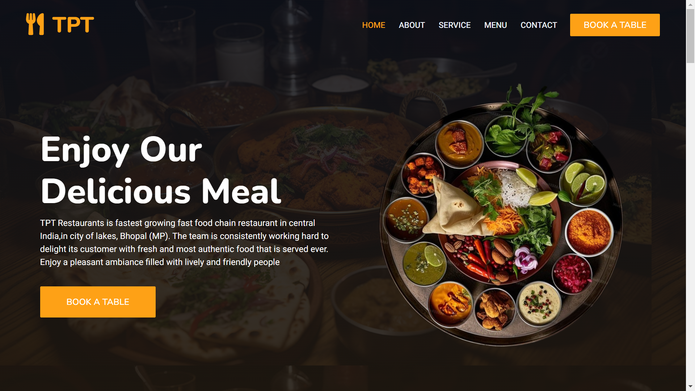
  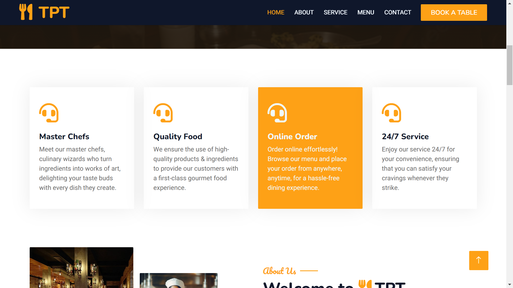
  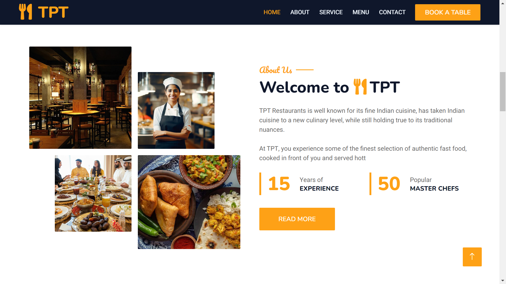
  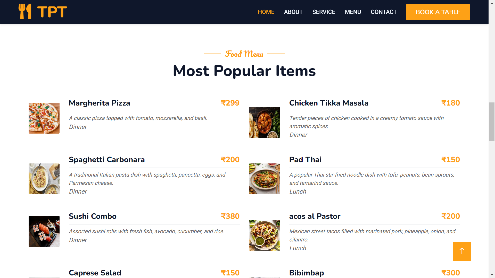
  
  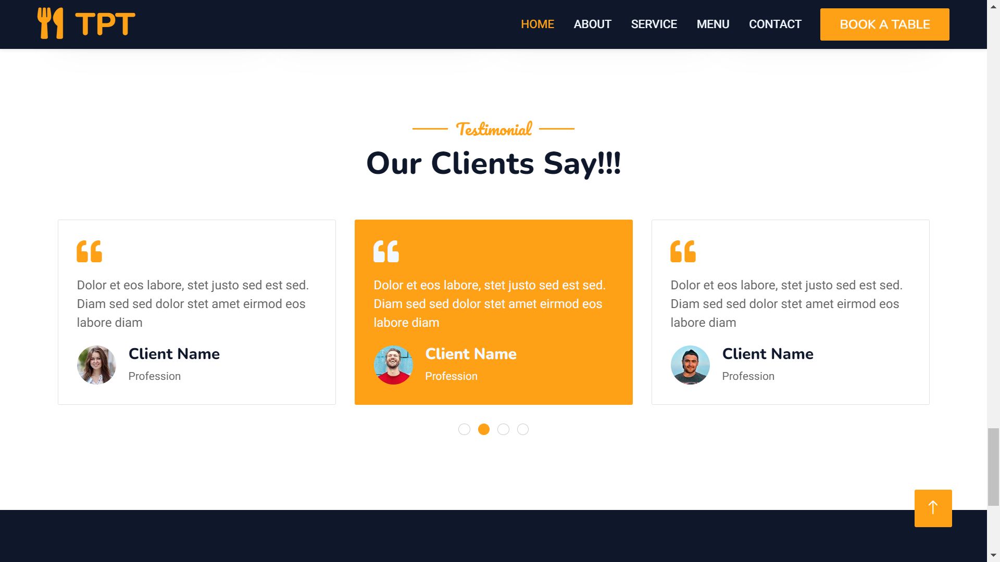
  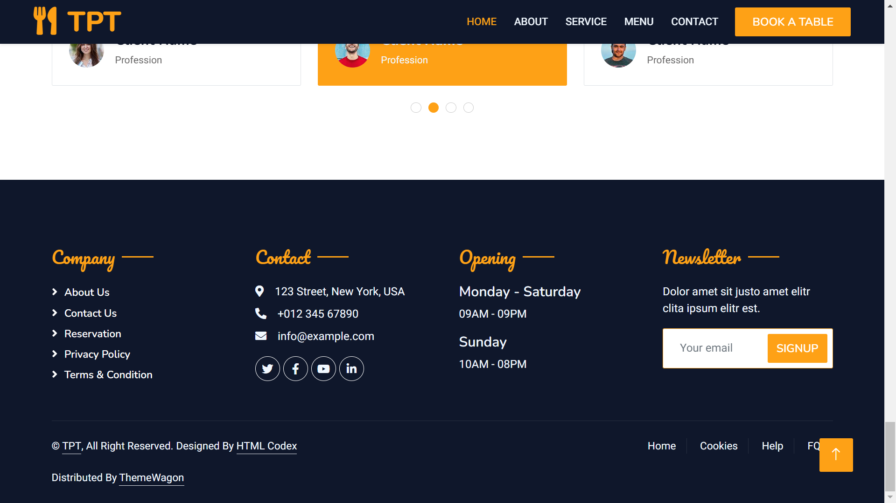
</div>


### Online Table Booking
This feature allows users to book a table online by filling out a form with details such as name, date, phone, email, number of people, and special requests. Once the booking is confirmed by the admin, the user automatically receives a confirmation email. This feature provides a seamless and user-friendly experience for customers.

<div style="display: flex; flex-wrap: wrap; gap: 10px;">
  
  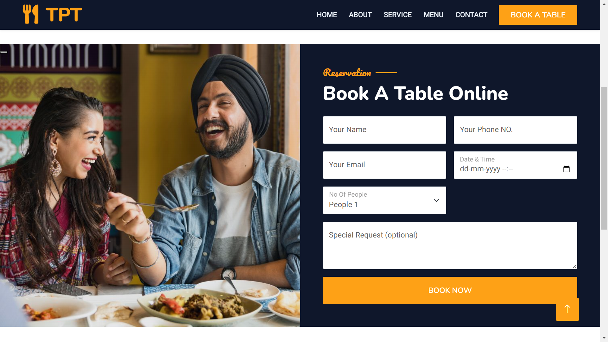
</div>

### Admin Panel
The authenticated admin panel provides options for the restaurant's admin to manage the website. Admins can add or update menu items, view and confirm booking requests, delete bookings, and print logs of previous bookings in PDF or Word format. This ensures that the restaurant management process is smooth and efficient.

<div style="display: flex; flex-wrap: wrap; gap: 10px;">
  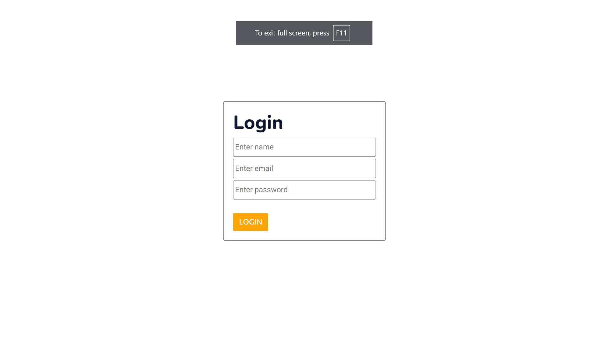
  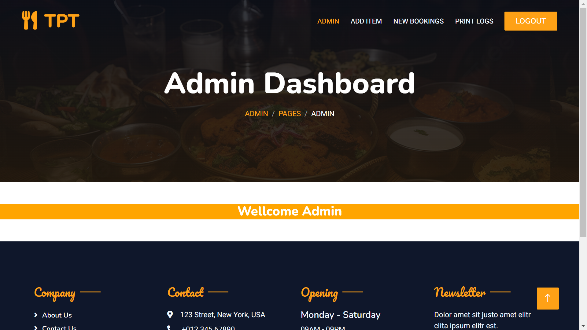
  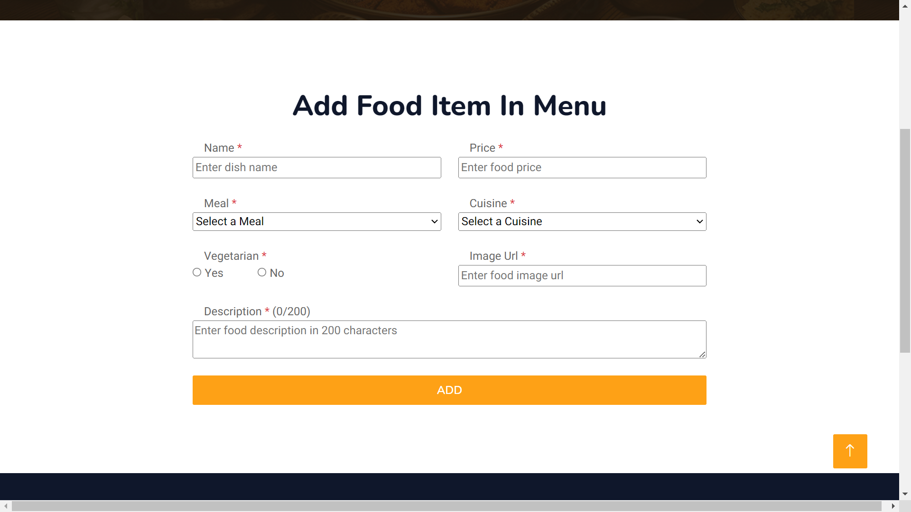
  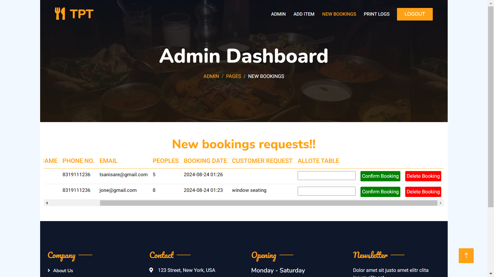
  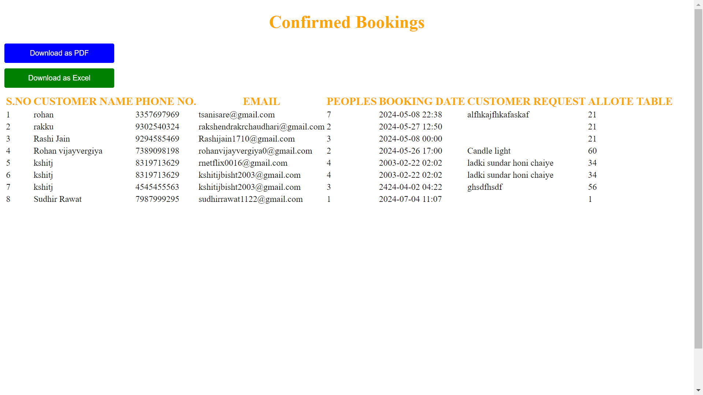
</div>


### Menu Display
Users can view the restaurant's menu online, making it easy for them to explore the offerings before booking a table or visiting the restaurant.

<div style="display: flex; flex-wrap: wrap; gap: 10px;">
  
</div>


### Testimonials
Display customer feedback and testimonials to build trust and showcase the positive experiences of previous visitors.

<div style="display: flex; flex-wrap: wrap; gap: 10px;">
  
</div>

### Location & Contact
This section provides information about the restaurant's location and contact details, making it easy for users to find and connect with the restaurant.

<div style="display: flex; flex-wrap: wrap; gap: 10px;">
  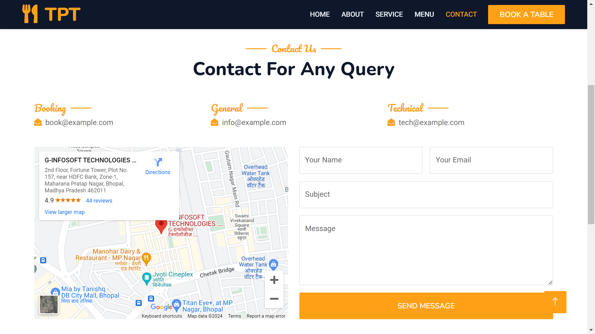
</div>


## Tech Stack
- **Frontend**: HTML, CSS, JavaScript
- **Backend**: PHP
- **Database**: MySQL
- **Email**: PHPMailer for automated email confirmations


## Installation

### Prerequisites: Download and Install XAMPP/WAMP/MAMP/LAMP
- Download XAMPP/WAMP (for Windows users) or MAMP (for Mac users) or set up LAMP (for Linux users).

### Clone the Repository
- Navigate to the `htdocs` directory in XAMPP/WAMP.
- Run the following command to clone the repository:
  ```bash
  git clone https://github.com/yourusername/TPT-Restaurant-Cafe.git
  ```

### Move the Project to the Server Directory
- Move the cloned project folder to the appropriate server directory.

### Start Apache and MySQL Servers
- Open the XAMPP/WAMP/MAMP/LAMP control panel and start both the **Apache** and **MySQL** servers.

### Create a MySQL Database
- Open your web browser and go to `http://localhost/phpmyadmin/`.
- Import the SQL file that comes with the project:
  - Click on the `Import` tab.
  - Choose the `.sql` file located in the project folder (e.g., `database.sql`).
  - Click `Go` to import the database structure and data.

### Configure Database Connection
- Update the database connection details in the project's `config.php` file with your local environment settings.

### Access the Project in Your Browser
- After setting up, open your web browser and navigate to `http://localhost/TPT-Restaurant-Cafe/` to access the website.
- For the admin panel, go to `http://localhost/TPT-Restaurant-Cafe/admin`.

### Install PHP Dependencies (if needed)
- If the project uses external PHP libraries, you may need to install them via Composer:
  ```bash
  composer install
  ```

